# Remember

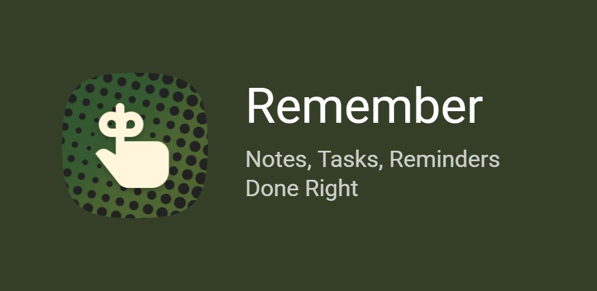

**Never lose an important reminder to an accidental swipe.**

You're clearing your notification shade — swiping away emails, messages, news — and a reminder goes with them. You didn't mean to. Now you're not sure what it said, just that it was probably important. That brief flash of *"wait, what was that?"* is the problem Remember solves.

If a reminder notification gets swiped away without being marked Done, Remember brings it back. Not as nagging — just a quiet signal that something is still waiting. Mark it done and it's gone for good.

## 📦 Downloads

[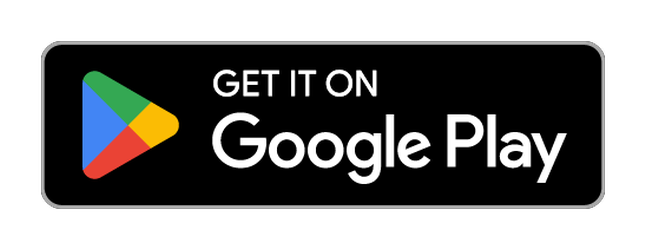](https://play.google.com/store/apps/details?id=dev.bikram.remember)

## ✨ Features

### ⏰ Reminders that actually work

- **Keep reminders until done.** The feature the app is built around. Enable it, and accidental dismissals stop mattering — Remember re-posts the notification until the note is marked done.
- **Snooze that speaks human.** Presets like *soon*, *later today*, *this evening*, *tomorrow morning*, or pick a custom date and time — not arbitrary minute counts.
- **Multiple reminders per note.** Add up to three reminders to the same note, each with its own time and repeat pattern.
- **Action buttons in the notification.** A reminder to call someone shows a call button right there. A reminder to pick something up shows directions. You can act on the reminder right from the notification.
- **High-importance mode.** Heads-up alerts, sound, and vibration for the things that cannot wait.
- **Recurring reminders.** Simple intervals (*daily, weekly, monthly, yearly*) or calendar-grade patterns like *the last Friday of every month* — the kind most reminder apps can't do. With an end date or repeat count. When you mark one done, the next is automatically scheduled.
- **Reminder summary.** A silent, persistent notification in the shade showing everything overdue and coming up — no sound, no interruption, just always there to keep you informed.
- **Reliable on Android.** Remember requests the permissions that make scheduled reminders actually fire — exact alarm access, battery optimization exemptions — and walks you through enabling them.

### 📝 Notes and lists that carry the full context

Reminders are more useful when they carry information. Remember's notes and lists are the container for that.

- **Markdown notes** with headings, formatting, links, and code blocks — so a reminder about a meeting can include the agenda.
- **Checklists** with nested items and drag-to-reorder — so a grocery run or a packing list can live inside the reminder itself.
- **Attachments and pictures** show up on the note card and inside reminder notifications. Cover images can be repositioned to frame exactly how you want.
- **Note icons** from hundreds of Material Symbols or the full emoji set — so every note is visually distinct at a glance.

### 🗂️ Always findable

- **Full-text search** across note titles, bodies, checklist items, tags, and action details.
- **Tags with colors** for grouping notes any way you like.
- **Star** notes for quick access. **Archive** ones you want to keep but not see. Or send to **Trash** that clears after 30 days automatically.
- **Filter** by type, tag, starred status, has-reminder, has-picture, or has-attachment.
- **Sort and group** by last modified, created date, or reminder time — grouped by date, type, or tag.
- **List or grid view** for note cards, so you can choose a compact list or a visual mosaic.

### 🎨 Looks the way you want it to

Remember has a deep theme engine — keep it minimal, make it colorful, or match it to your phone exactly.

- **Theme modes:** System, Light, Dark, or Black (OLED-optimized).
- **Color sources:** Material You wallpaper colors (Android 12+), eight hand-tuned presets, or custom hex input with multiple saved values.
- **Nine palette styles** — Tonal Spot, Vibrant, Expressive, Monochrome, and more.
- **Visual effects:** gradient backgrounds, enhanced shading, frosted-glass blur bars, and cover images on cards.
- **Adaptive note themes:** note cards can pick up colors from their cover image automatically.

### 🔒 Privacy and security

- **App lock** with device credential unlock, and biometric authentication. No need to create a new PIN. 
- **Note visibility levels:** Default (full notification), Private (hides notification body), or Secret (hides everything — no widget or notification content).
- **No account required.** Your notes are stored entirely locally. Zero tracking, analytics, or automated background telemetry.

### 💾 Backup and import

- **Manual backup and restore**: export to any folder, including cloud drives.
- **Auto-export** on every change, or on a schedule via background worker.
- **Media inclusion**: optionally embed pictures and attachments in the backup file.
- **Import from Google Tasks**: via OAuth sign-in or a Takeout JSON file, with three import modes: one note per task, grouped by list, or a list as a checklist.

### 🏠 Widgets and shortcuts

- **Agenda widget**: upcoming and overdue reminders at a glance, in a 7-day window.
- **Starred widget**: your favorite notes on the home screen.
- **Quick capture widget**: one tap to create a new note or list.
- **Launcher shortcuts**: long-press the app icon to jump straight to a new note or list.

## 🖼️ Screenshots

<table>
<tr>
<td width="33%" align="center" valign="top">
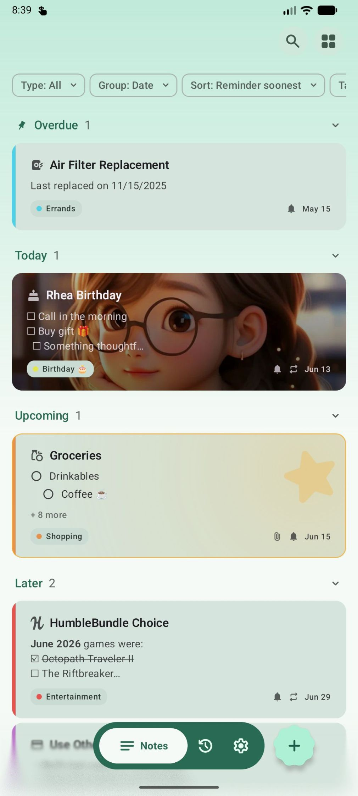 
</td>
<td width="33%" align="center" valign="top">
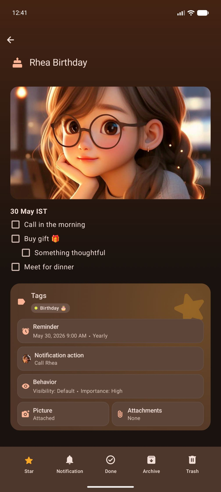 
</td>
<td width="33%" align="center" valign="top">
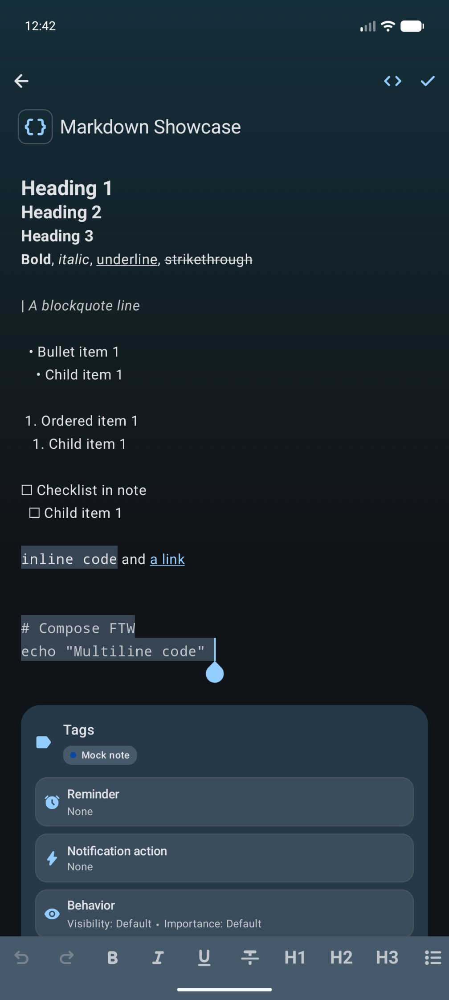 
</td>
</tr>

<tr>
<td width="33%" align="center" valign="top">
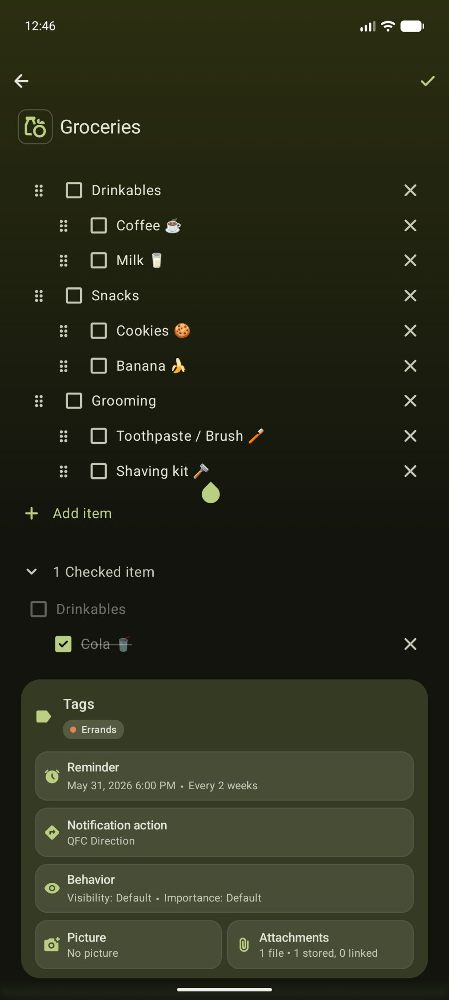 
</td>
<td width="33%" align="center" valign="top">
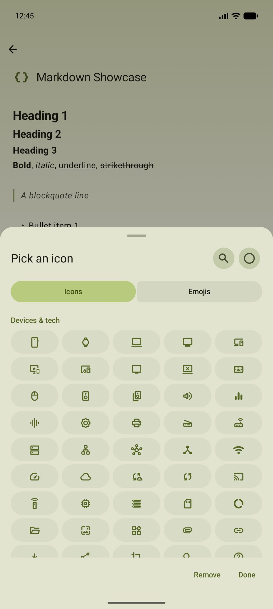 
</td>
<td width="33%" align="center" valign="top">
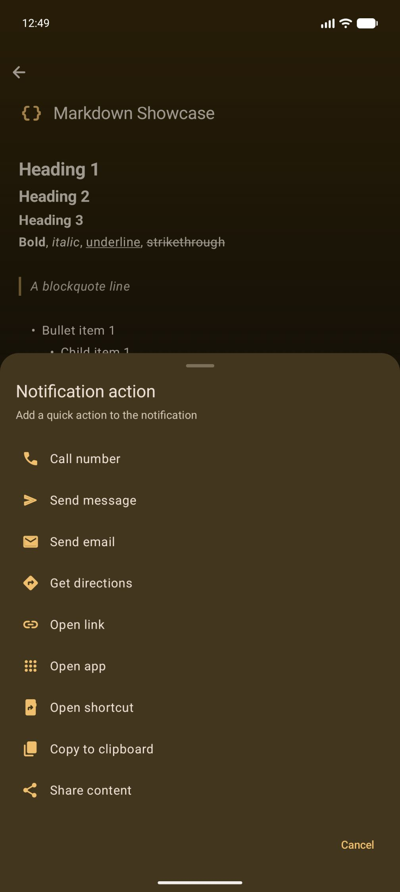 
</td>
</tr>

<tr>
<td width="33%" align="center" valign="top">
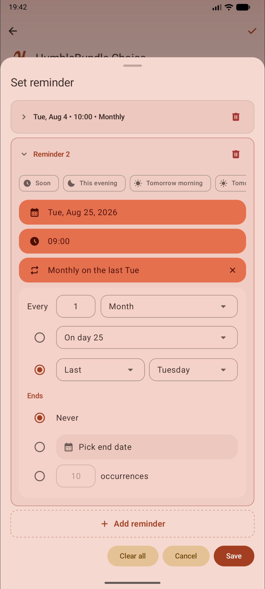 
</td>
<td width="33%" align="center" valign="top">
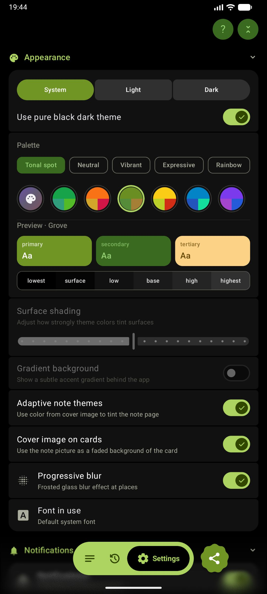 
</td>
<td width="33%" align="center" valign="top">
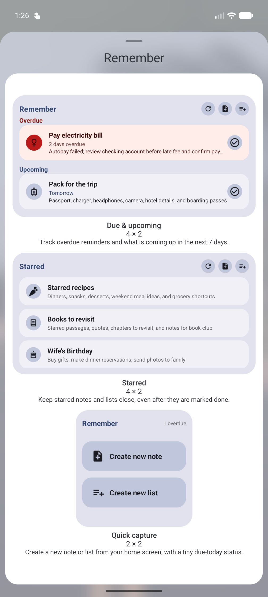 
</td>
</tr>
</table>

<table>
<tr>
<td width="50%" align="center" valign="top">
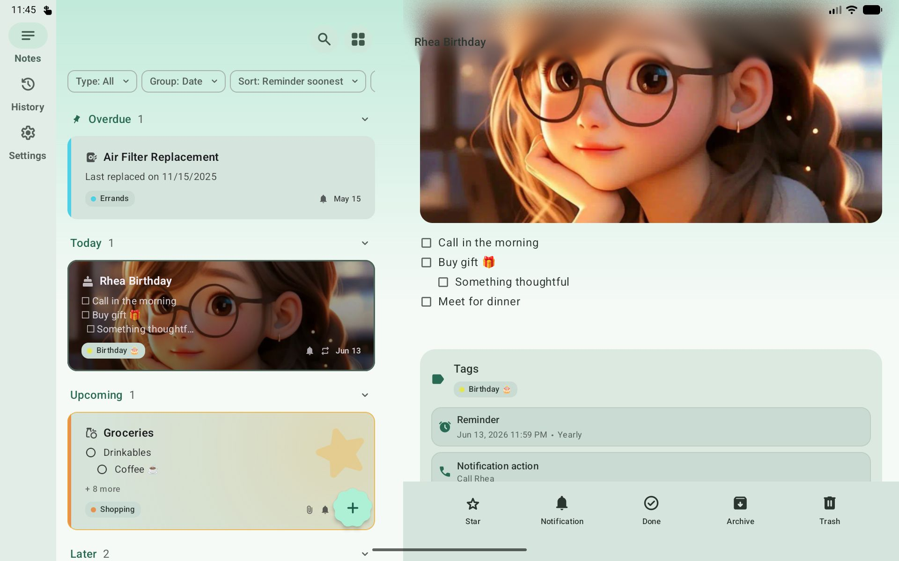 
</td>
<td width="50%" align="center" valign="top">
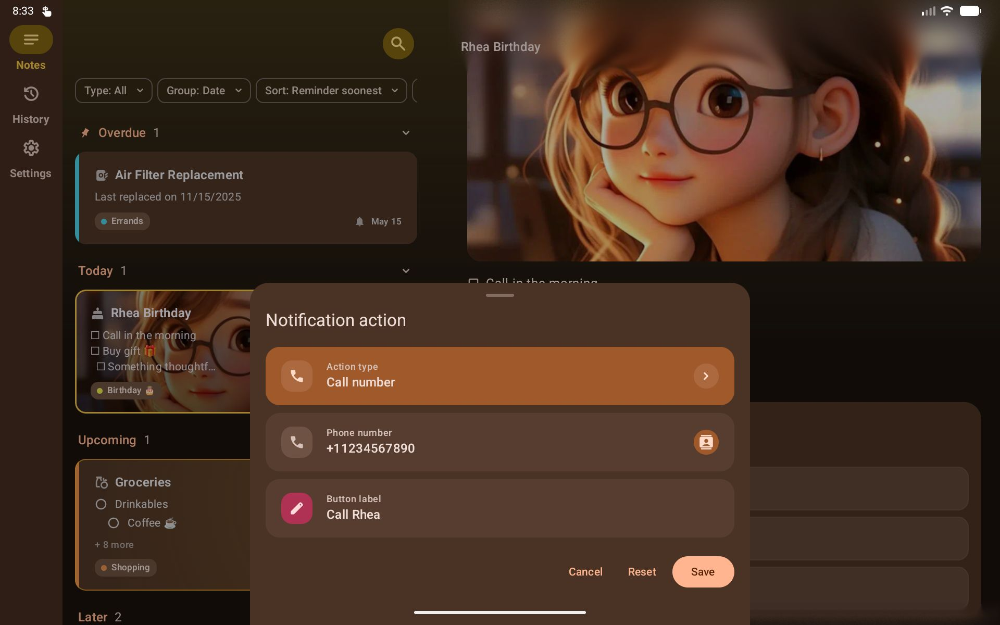 
</td>
</tr>

<tr>
<td width="50%" align="center" valign="top">
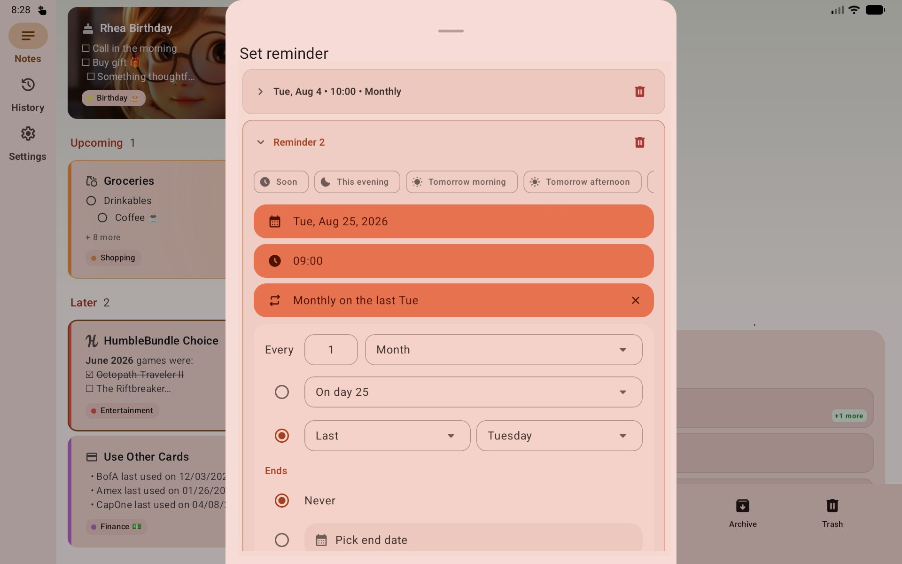 
</td>
<td width="50%" align="center" valign="top">
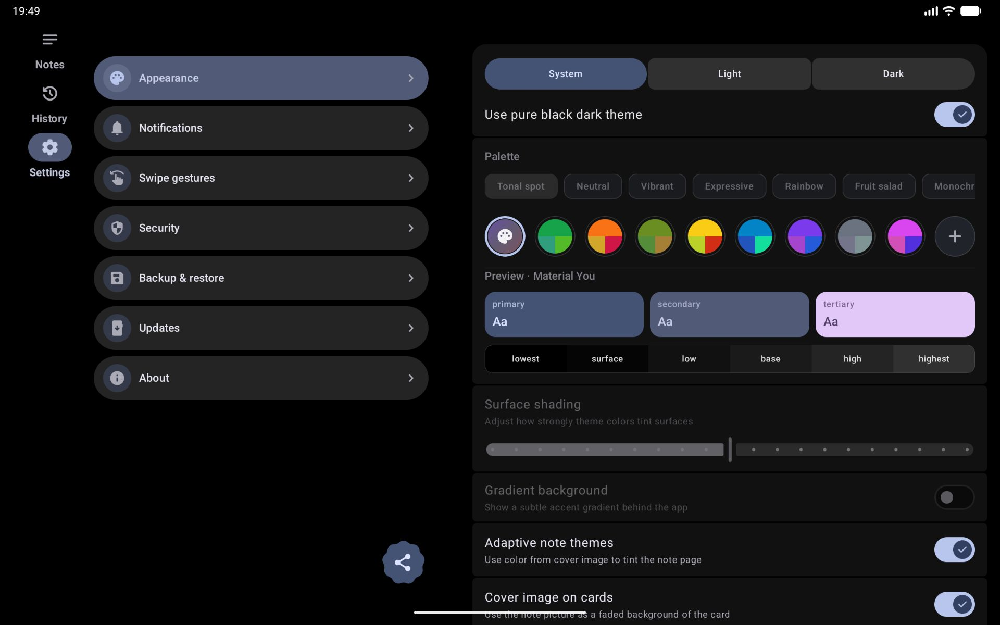 
</td>
</tr>
</table>

## 🌍 Languages

Remember is available in the following languages:

- **English** (default)
- **Español** (Spanish)
- **Français** (French)
- **Deutsch** (German)
- **Português** (Portuguese)
- **Italiano** (Italian)

The app automatically uses your system language if it's one of the above. You can also override it in **Settings → Language**. On Android 13+, per-app language preferences in system settings are also supported.

Want to help translate Remember into your language? See [docs/TRANSLATIONS.md](docs/TRANSLATIONS.md) for guidelines.

## ⚖️ License & Trademark Notice

The source code of this project is licensed under the GNU General Public License v3.0 (see the [LICENSE](LICENSE) file). 

However, the application names "Remember", "FilePipe", and "ObtainX", along with all original branding artwork, logos, and custom launcher icons, are the exclusive intellectual property and trademarks of the author. Redistribution or modification of the source code under the GPLv3 does not grant permission to use these brand assets in derivative works. All forks must be entirely rebranded.

---

Made with ❤️ by Bikram Agarwal
