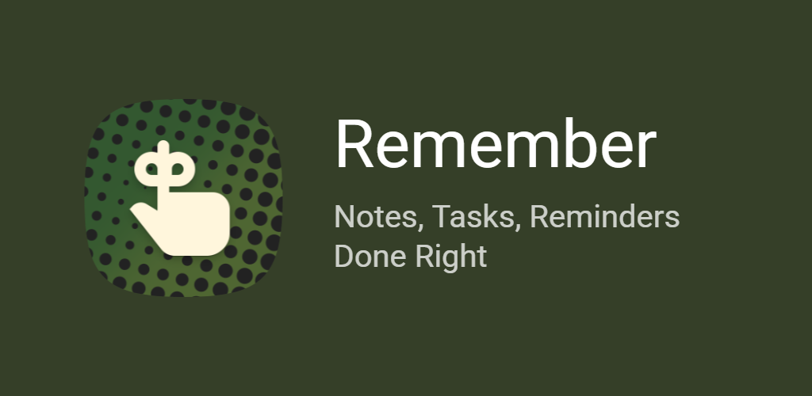

# Remember

**Never lose an important reminder to an accidental swipe.**

You're clearing your notification shade — swiping away emails, messages, news — and a reminder goes with them. You didn't mean to. Now you're not sure what it said, just that it was probably important. That brief flash of *"wait, what was that?"* is the problem Remember solves.

If a reminder notification gets swiped away without being marked `Done`, Remember brings it back. Not as nagging — just a quiet signal that something is still waiting. Mark it done and it's gone for good.

---

## Reminders that actually work

- **Keep reminders until done.** The feature the app is built around. Enable it, and accidental dismissals stop mattering — Remember re-posts the notification until the note is marked done.
- **Action buttons in the notification.** A reminder to call someone shows a call button right there. A reminder to pick something up shows directions. You can act on the reminder right from the notification.
- **Snooze that speaks human.** Presets like *soon*, *later today*, *this evening*, and *tomorrow morning* — not arbitrary minute counts.
- **High-importance mode.** Heads-up alerts, sound, and vibration for the things that cannot wait.
- **Recurring reminders.** Simple intervals (*daily, weekly, monthly, yearly*) or calendar-grade patterns like *the last Friday of every month* — the kind most reminder apps can't do. With an end date or count. When you mark one done, the next is already scheduled.
- **Reminder summary.** A silent, persistent notification in the shade showing everything overdue and coming up — no sound, no interruption, just always there to keep you informed.
- **Reliable on Android.** Remember requests the permissions that make scheduled reminders actually fire — exact alarm access, battery optimization exemptions — and walks you through enabling them.

---

## Notes and lists that carry the full context

Reminders are more useful when they carry information. Remember's notes and lists are the container for that.

- **Markdown notes** with headings, formatting, links, and code blocks — so a reminder about a meeting can include the agenda.
- **Checklists** with nested items and reordering — so a grocery run or a packing list can live inside the reminder itself.
- **Attachments and pictures** show up on the note card and inside reminder notifications.
- Tags, favorites, archive, search, filters, and flexible sorting keep everything findable.
- Home-screen widgets for upcoming reminders, quick capture, and starred notes.

---

## Looks the way you want it to

Remember has a deep theme engine — Material You wallpaper colors, eight hand-tuned presets, custom hex color input, nine palette styles, gradient backgrounds, progressive blur bars, and more. Keep it minimal, make it colorful, or match it to your phone. It's a personal app; it should feel personal.

---

## No account required

Notes are stored on-device. No Remember servers. Manual backup and restore let you move or protect your data on your own terms. Import from Google Tasks if you're switching over.

---

## Download

Coming soon
---

**Links:** [Project site](https://bikram-agarwal.github.io/remember/) · [Privacy policy](https://bikram-agarwal.github.io/remember/privacy)
